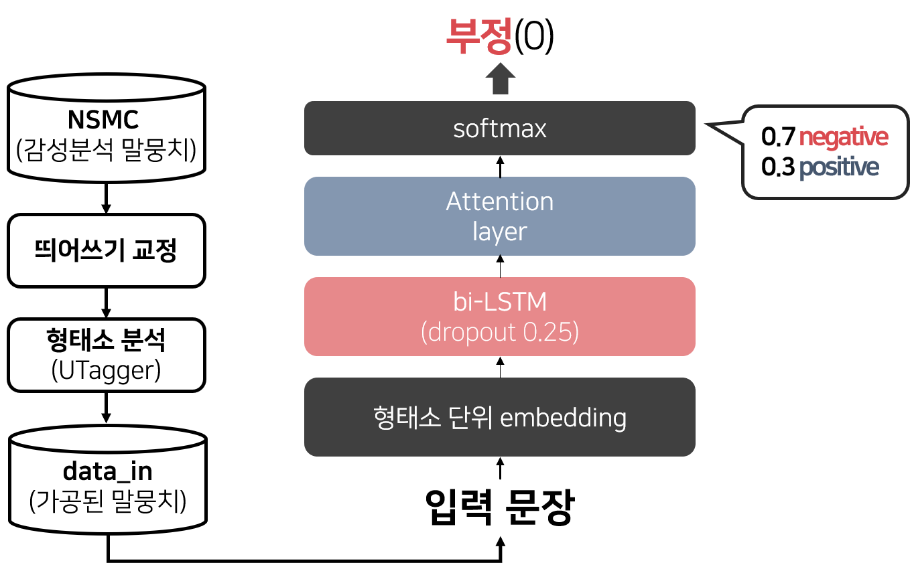

# sentiment-analysis
NSMC(Naver Sentiment Movie Corpus)를 활용한 Bi-LSTM(attention) Sentiment Analysis
- NSMC : https://github.com/e9t/nsmc

### Data
NSMC에 대해 띄어쓰기 교정 및 형태소 분석을 완료한 데이터를 사용(data_in)

- 띄어쓰기 교정 : __[확률기반 띄어쓰기 모델](https://www.dbpia.co.kr/journal/articleDetail?nodeId=NODE09874447)__ (추후 UTagger의 기능으로 추가 예정)
- 형태소 분석 : __[울산대학교의 형태소 분석기 UTagger](http://klplab.ulsan.ac.kr/doku.php?id=start)__

### Package
2019년 6월 쯤에 작성한 코드이기 때문에 tensorflow v1을 사용
- tensorflow v1.15
- gensim
- numpy

### model

### Reference
- [Base model](https://github.com/MSWon/Sentimental-Analysis)
- [Attention](https://github.com/graykode/nlp-tutorial/blob/master/archive/tensorflow/v1/4-3.Bi-LSTM(Attention)/Bi-LSTM(Attention).py)
